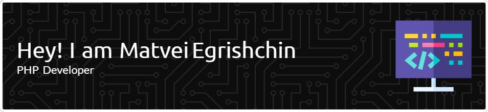

<!--  -->

I'm a **PHP & Go Developer** focused on crafting efficient and scalable backend applications. I build robust APIs and services with **PHP** and **Go**, and I also enjoy developing dynamic user interfaces using **Vue.js** and **TypeScript**.
 
 ## 🛠️ Tech Stack & Tools

**Backend** 
                                   

**Frontend** 

<!--**Tools** -->
<!---->

<!--## 🛠️ Tech Stack & Tools-->

<!---->
<!---->
<!---->
<!---->
<!---->
<!---->
<!---->
<!---->
<!---->
<!---->
<!---->
<!---->
<!---->
<!---->
<!---->
<!---->
<!---->
<!---->

<!--## 🚀 My Projects-->

<!--Here are a few projects I've been working on:-->

<!--| Project Name         | Description                                          |-->
<!--| -------------------- | ---------------------------------------------------- |-->
<!--| 💡 BioState          | Brief one-line description of the project.         |-->
<!--| ✨ Ollama SDK| Short description of another project.              |-->
<!--| 🛠 Talk to Ai | Concise description of this project.               |-->

<!---->
